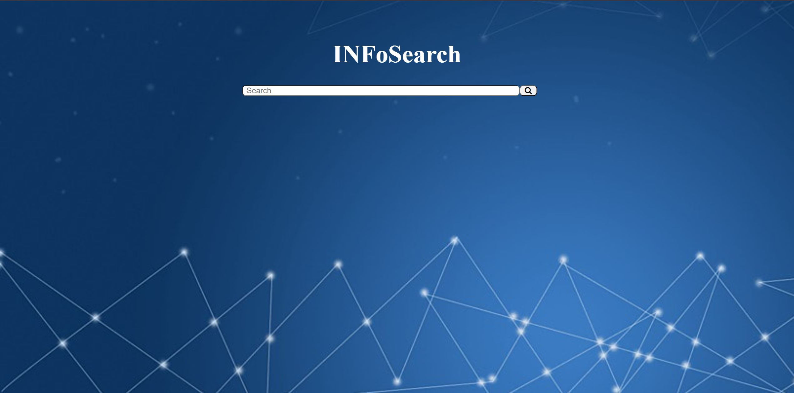
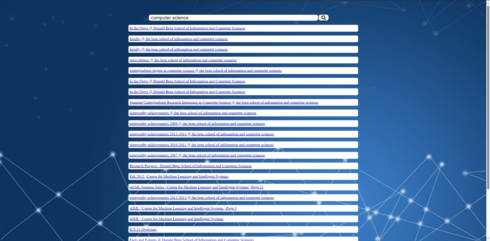
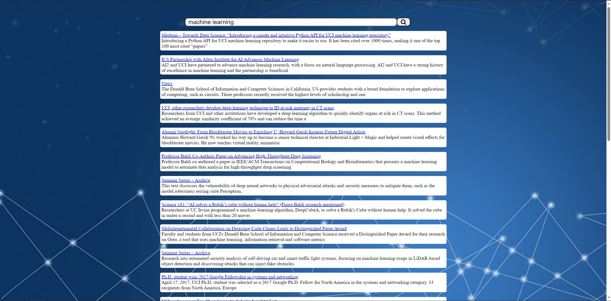

# About the Search Engine

This is an inverse-term matrix search engine built for Computer Science 121/Informatics 141 course @ UCI in Python. It indexes a cached version of the UCI ICS domain to create the matrix, with which it is capable of performing searches within 15-100ms. The search engine uses the OpenAI API to generate an AI summary of each page to display on search.

The code within the `gui` directory is a simple flask server to act as the user interface for the search engine. Within the `src` directory are a number of important files for the engine:
- `config.py` creates a Config object responsible for parsing `config.ini` and exposing the configuration settings to the other parts of the program.
- `helpers.py` specifies a number of miscellaneous helper functions.
- `indexer.py` is responsible for indexing the json files of the data source.
- `matrix.py` creates the Matrix object which represents the inverse-term matrix within the program and allows for fast searching.
- `query.py` manages querying the Matrix for search terms.
- `ranker.py` computes the Pagerank score for each site during indexing.
- `refactor.py` defines a Refactor function capable of refactoring an index and breaking it up according to an arbitrary number of breakpoints. This is legacy code from an earlier version of the Indexer.

## Running the Engine

`run.py` is the main entry point to the engine: it starts up the browser user interface. `main.py` serves as the terminal entry point allowing command-line arguments to control the program. However, the indexes and data source are missing from this repo due to their large size.

## Demo

The search engine opens onto the browser search page:

Searching something yields the search results:

At the bottom of the page, the statistics are revealed for search time:

The AI summaries are not displayed in the above images as they are from a full index search. OpenAI limits you to 2 API calls per minute, meaning it would take almost 20 days to generate just the 56000 summaries for UCI ICS domain. They also limit how many API calls you can make at all before having to pay. As such, I summarized a small subgroup of the pages to demonstrate the concept even though I can't use it on the full index.
